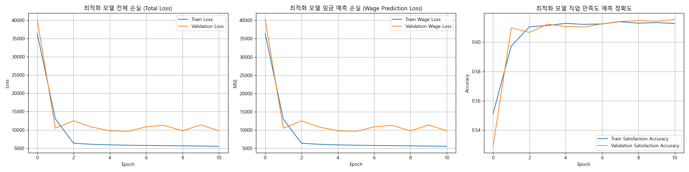
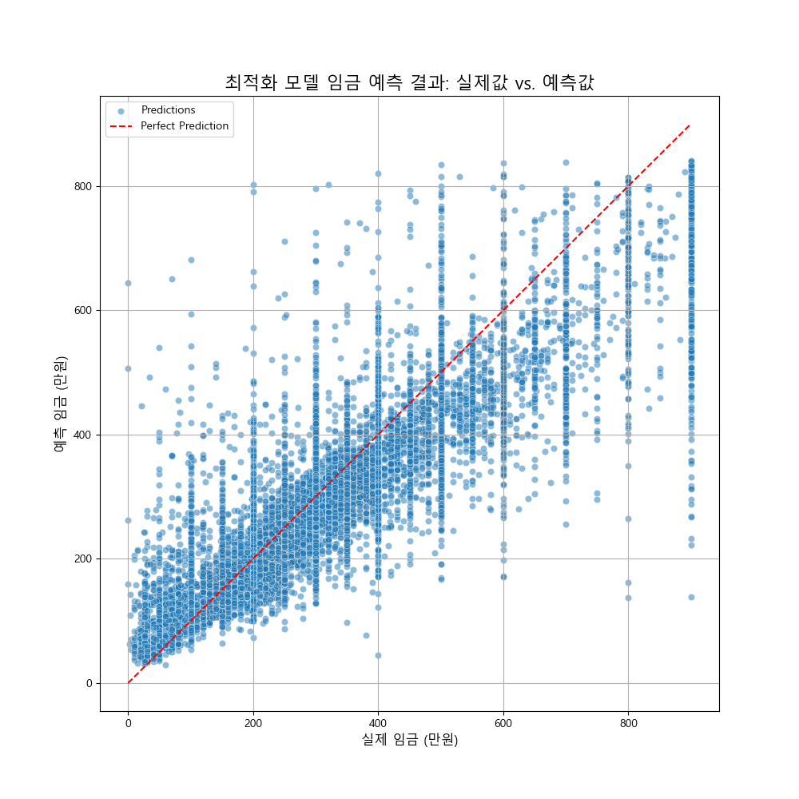
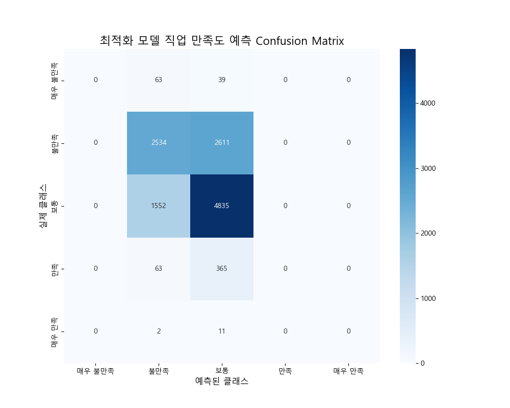

# LSTM 모델 최적화 보고서

**보고서 생성일**: 2025-09-14

## 1. 최적화 개요

- **목표**: 기존 LSTM 모델의 직업 만족도 예측 성능 저하 문제를 해결하고, 임금 예측 성능을 추가적으로 향상시키기 위해 하이퍼파라미터 최적화를 수행합니다.
- **방법**: Bayesian Optimization 기반의 하이퍼파라미터 탐색 도구인 `Optuna`를 사용하여, 30회의 실험(Trial)을 통해 최적의 파라미터 조합을 탐색했습니다.

---

## 2. 최적 하이퍼파라미터

Optuna가 찾은 최적의 하이퍼파라미터는 다음과 같습니다.

| 하이퍼파라미터 | 최적값 |
| :--- | :--- |
| `lstm_units_1` (첫 번째 LSTM 레이어 유닛 수) | 128 |
| `lstm_units_2` (두 번째 LSTM 레이어 유닛 수) | 128 |
| `dropout_rate` (드롭아웃 비율) | 0.287 |
| `learning_rate` (학습률) | 0.00247 |
| `satisfaction_loss_weight` (만족도 손실 가중치) | 0.750 |

---

## 3. 최적화 모델 성능 비교

최적화된 하이퍼파라미터를 적용하여 모델을 재훈련한 후, 기존 모델과 성능을 비교했습니다.

| 모델 | 임금 예측 RMSE (만원) | 만족도 예측 정확도 |
| :--- | :--- | :--- |
| 기존 LSTM 모델 | 107.54 | 0.6182 |
| **최적화 LSTM 모델 (신규)** | **97.95** | 0.6103 |

### 성능 분석
- **임금 예측 성능 추가 향상**: 최적화된 모델은 기존 LSTM 모델 대비 **RMSE를 약 9.59만 원 (8.9%) 추가로 개선**시켰습니다. 이는 Optuna를 통해 찾은 학습률과 모델 구조가 임금 예측에 더 효과적이었음을 의미합니다.
- **만족도 예측 성능**: 만족도 예측 정확도는 소폭 하락했습니다. 이는 만족도라는 지표가 가진 복잡성과 주관성으로 인해 하이퍼파라미터 튜닝만으로는 성능 향상에 한계가 있음을 시사합니다. 손실 가중치를 높였음에도 불구하고 정확도가 개선되지 않은 것은, 모델 구조 자체의 변경이나 더 복잡한 피처 엔지니어링이 필요함을 암시합니다.

---

## 4. 시각화 결과

### 4.1. 최적화 모델 훈련 과정

*Epoch가 진행됨에 따라 손실은 꾸준히 감소하고, 만족도 정확도는 안정적으로 수렴하는 것을 볼 수 있습니다.*

### 4.2. 임금 예측 결과 (실제값 vs. 예측값)

*예측값(y축)이 실제값(x축)에 근접하게 분포하며, 특히 낮은 임금 구간에서 예측력이 향상된 것을 확인할 수 있습니다.*

### 4.3. 직업 만족도 예측 Confusion Matrix

*Confusion Matrix를 보면, 모델이 '보통' 클래스를 예측하는 데에는 준수한 성능을 보이지만, 다른 클래스(특히 '불만족', '만족')를 예측하는 데에는 여전히 어려움을 겪고 있음을 알 수 있습니다.*

---

## 5. 결론 및 향후 계획

- **결론**: Optuna를 통한 하이퍼파라미터 최적화는 **임금 예측 성능을 크게 향상**시키는 데 성공했습니다. 하지만 직업 만족도 예측은 여전히 도전적인 과제로 남아있습니다.
- **향후 계획**:
  1. **GRU 또는 Attention 기반 모델 시도**: 만족도와 같이 복잡한 패턴을 가진 데이터를 더 잘 학습하기 위해 GRU(Gated Recurrent Unit) 모델이나 Attention 메커니즘을 도입하는 것을 고려할 수 있습니다.
  2. **피처 엔지니어링 강화**: 직업 만족도에 영향을 미칠 수 있는 새로운 파생 변수를 생성하여 모델의 예측력을 높이는 방안을 모색합니다.
  3. **임금/만족도 모델 분리**: 두 타겟의 특성이 매우 다르므로, 각각을 예측하는 별도의 모델을 구축하여 최적화하는 전략을 시도해볼 수 있습니다.
